<!-- markdownlint-disable -->
<h1>RobotReviewer</h1>

- [Systematic Review (SR)?](#systematic-review-sr)
- [What is RobotReviewer?](#what-is-robotreviewer)
- [Source codes](#source-codes)
- [Methods](#methods)
    - [Datasets](#datasets)
    - [Models](#models)
      - [Screenshots](#screenshots)
    - [Results](#results)
- [References](#references)

---
### Systematic Review (SR)?
A systematic review (SR) is a rigorous and comprehensive research approach that ***summarizes, evaluates, and synthesizes existing evidence on a specific research question or topic***. It involves systematically searching for relevant studies, critically appraising their quality, extracting data, and analyzing and interpreting the findings. SRs provide reliable and unbiased summaries of evidence to inform decision-making, policy development, and further research. They are widely used in fields like medicine, healthcare, psychology, and social sciences to inform practice, guidelines, and policy recommendations. SRs follow a predefined methodology to minimize bias and ensure reproducibility, making them a gold standard for evidence synthesis.

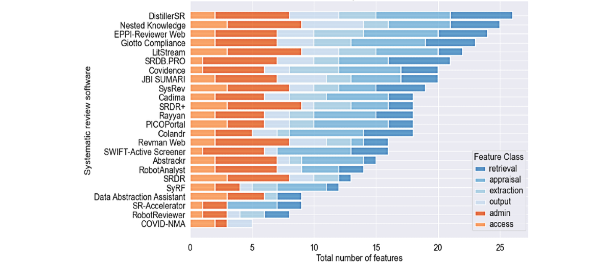
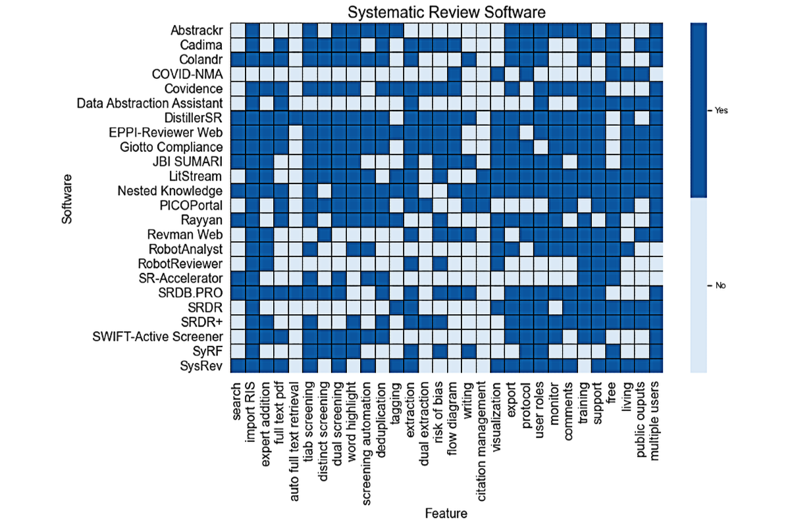

Description of each **feature class** in systematic reviews, along with a use case or feature example in the context of a web or mobile app:

1. **Retrieval**: The tool allows users to search for relevant studies directly within the app, saving time and effort. For example, a web app may have a `built-in search function` that retrieves studies from various databases without the need to navigate to external sources.

2. **Appraisal**: The app helps assess the quality of included studies. For instance, a mobile app may offer `dual screening and adjudication features`, allowing multiple reviewers to `independently evaluate and resolve disagreements` on the relevance of study titles and abstracts.

3. **Extraction**: The app facilitates the extraction of data from selected studies. For example, a web-based tool may provide user-friendly forms or templates for systematically `capturing study characteristics, outcomes, and results`, making the data extraction process more organized and efficient.

4. **Output**: The app generates and presents the findings of the systematic review. For instance, a web or mobile app might offer options to `export references or collected data in standard formats, generate visual summaries like tables or charts`, and provide tools for writing reports or generating in-text citations.

5. **Admin**: The app includes administrative features to `manage the systematic review process`. For example, a web-based platform might provide functionalities like protocol templates, a customer support system, progress/activity tracking dashboards, and the ability to add comments or annotations for collaboration among reviewers.

6. **Access**: The app `enables collaboration, controls cost, and provides accessibility`. For example, a web or mobile app might allow multiple users to collaborate on a systematic review project, offer both free and paid subscription plans with varying features, and support the ability to update and revise reviews with new evidence.

These brief descriptions and use cases demonstrate the key features and benefits of each feature class in the context of a web or mobile app for systematic reviews.

### What is RobotReviewer?
*Automatic synthesis of RCTs or Automatic extraction of data from clinical trial reports*

**RobotReviewer** is a system for **providing automatic annotations from clinical trials** (in PDF format). Currently, RobotReviewer provides data on the trial PICO characteristics (Population, Interventions/Comparators, and Outcomes), and also automatically assesses trials for likely biases using the Cochrane Risk of Bias tool.

The full RobotReviewer system (shown above) performs a risk of bias assessment using the Cochrane Risk of Bias tools. In general, RobotReviewer accepts as input the full text of clinical trial reports (as PDFs). For the version deployed within Trip, RobotReviewer performs a more limited assessment based on the title and abstract only. Moreover, in this case bias predictions are limited to the Random sequence generation, Allocation concealment, and Blinding domains.

The system should reliably perform two tasks:
- **1/ determine whether a trial is at low risk of bias** (document classification of low v high or unclear risk of bias),
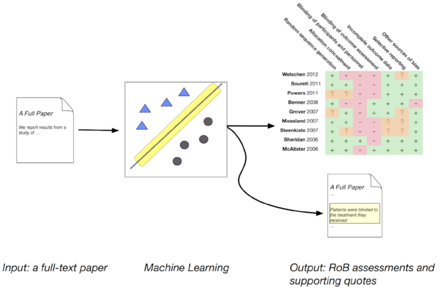

- **2/ identify text from the trial report that supports these bias judgments** (sentence classification of relevant v irrelevant). Example of our prototype system showing the bias assessment for random sequence generation and a supporting sentence:
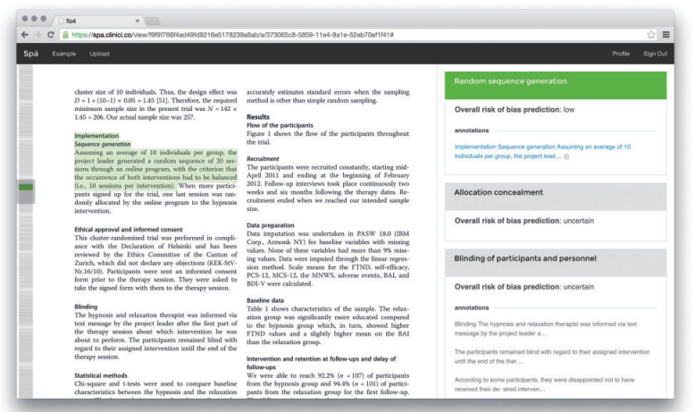

### Source codes
[ijmarshall/robotreviewer](https://github.com/ijmarshall/robotreviewer)
Star: **120**
Created date: **7 years ago**
Latest release date: **2022-07-18**

### Methods

##### Datasets
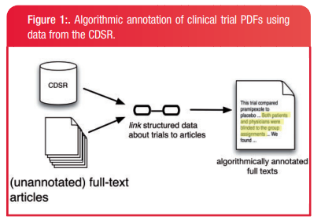
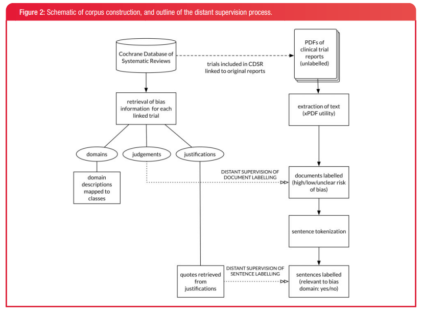

##### Models
From a machine-learning vantage point, 1) is a classification task and 2) is a data extraction problem.
- use `keras`
- use of [BERT embeddings](https://arxiv.org/pdf/1810.04805.pdf), specifically [SciBERT](https://github.com/allenai/scibert). For this we use the [bert-as-service](https://github.com/hanxiao/bert-as-service).
- using the `RCT classifier` in RobotReviewer
- use a novel multi-task learning approach: `multi-task variant of the soft-margin Support Vector Machine` (SVM)

###### Screenshots
- Bert embedding:
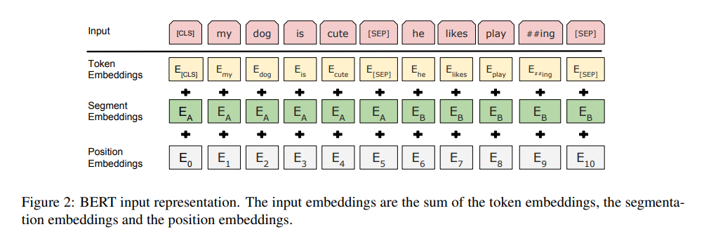

- `RCT classifier` in RobotReviewer:
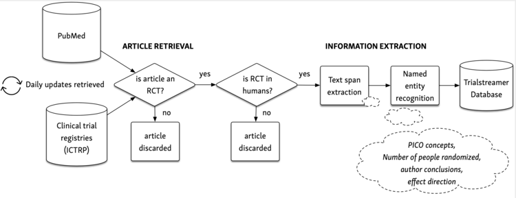
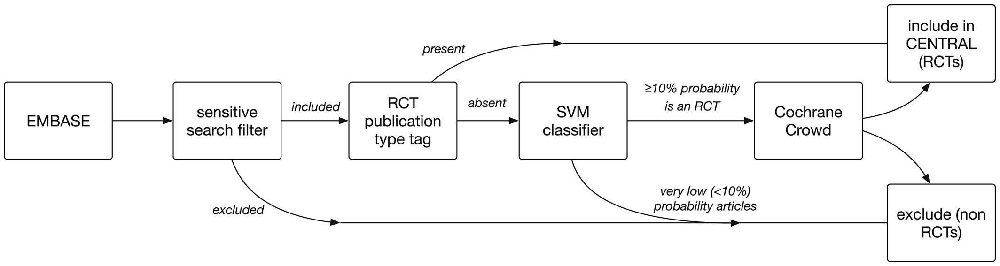
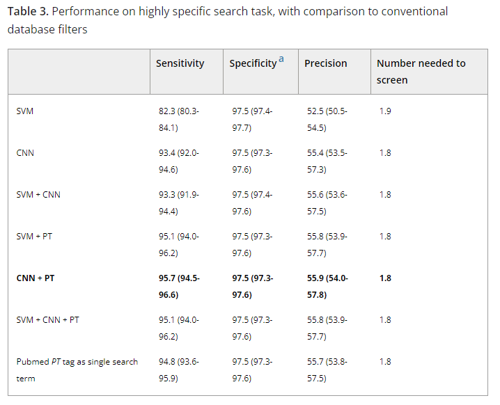

- `multi-task variant of the soft-margin Support Vector Machine`:
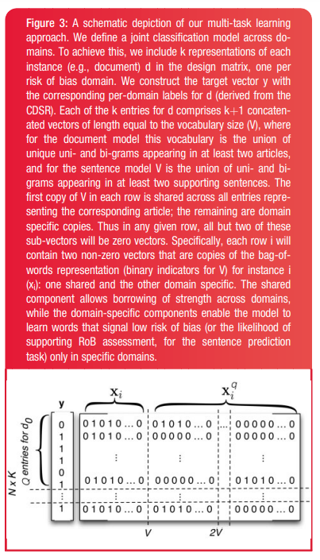

##### Results
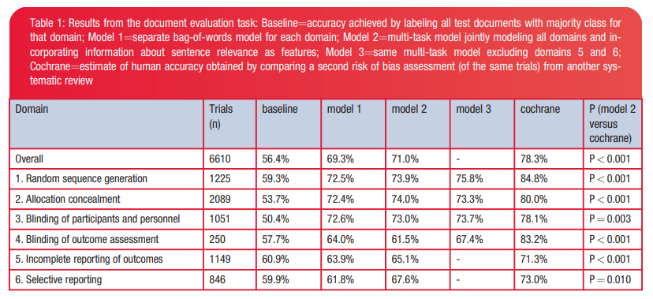

### References

SR:
[Web-Based Software Tools for Systematic Literature Review in Medicine: Systematic Search and Feature Analysis](https://medinform.jmir.org/2022/5/e33219)

RobotReviewer:
https://www.robotreviewer.net/
https://www.robotreviewer.net/blog
https://www.youtube.com/watch?v=9-FMT-HwNf4&ab_channel=IainMarshall
https://github.com/ijmarshall/robotreviewer

[Gist - Using the RCT classifier in RobotReviewer (from Python)](https://gist.github.com/bwallace/beebf6d7bbacfbb91704f66c28dcc537)

[Automating risk of bias assessment for clinical trials - ieee](https://ieeexplore.ieee.org/document/7104094)
[Automating risk of bias assessment for clinical trials - doi](https://dl.acm.org/doi/10.1145/2649387.2649406)
